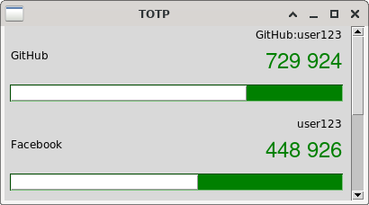

# TOTP generator implementation

> WARNING: sha1 is the only protocol implemented

Build and run the demo program.
It requires openssl for the sha1 implementation (```libssl-dev``` on debian based systems).

```shell
$ make # gcc -lcrypto main.c -o main
$ ./main
```

Run tests with

```shell
$ make test
```

# Usage

Copy and include ```totp.c``` in your project and define ```TOTP_IMPLEMENTATION``` in your main.

```c
#define TOTP_IMPLEMENTATION 1
#include "totp.c"
```

```c
uint32_t                   // OTP token (to display with leading zeros to get the right ammount of digits)
TOTP(BYTE* secret,         // The shared secret
     size_t secret_lenght, // The size of the secret in bytes
     uint digits,          // The number of digits for the otp token (6, 7 or 8)
     enum TOTP_Algo algo,  // The hashing algorithm used (TOTP_SHA1 only)
     time_t t0,            // The Unix time to start counting time steps (default is 0)
     time_t tx,            // The time step in seconds
     time_t t);            // The current time (time(NULL)) (check +- tx on servers to account for time desync)
```

# GUI

This project include a simple read only gui to get tokens. The GUI is made with python and tkinter.

OTP parameters are stored in ```otp_data.json```. The file follow the same format as [andOTP](https://github.com/andOTP/andOTP).

> WARNING: ```opt_data.json``` is a plain text file. Not ideal to store OTP secrets

``` shell
$ make lib
$ export LD_LIBRARY_PATH=$LD_LIBRARY_PATH:$(pwd)
$ python gui/gui.py gui/otp_data.json
```



## References

* [RFC4226](https://www.ietf.org/rfc/rfc4226.txt) HOTP Algorithm
* [RFC6238](https://www.ietf.org/rfc/rfc6238.txt) TOTP: Time-Based One-Time Password Algorithm
