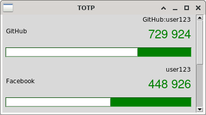

# TOTP implementation

> WARNING: sha1 is the only protocol implemented

Build and run the demo program

```shell
$ make # gcc -lcrypto main.c -o main
$ ./main
```


Run tests with

```shell
$ make test
```

# GUI

This project include a simple read only gui to get tokens. The GUI is made with python and tkinter.

OTP parameters are stored in ```otp_data.json```. The file follow the same format as [andOTP](https://github.com/andOTP/andOTP).

> WARNING: ```opt_data.json``` is a plain text file. Not ideal to store OTP secrets

``` shell
$ make lib
$ python gui.py
```



## References

* [RFC4226](https://www.ietf.org/rfc/rfc4226.txt) HOTP Algorithm
* [RFC6238](https://www.ietf.org/rfc/rfc6238.txt) TOTP: Time-Based One-Time Password Algorithm
